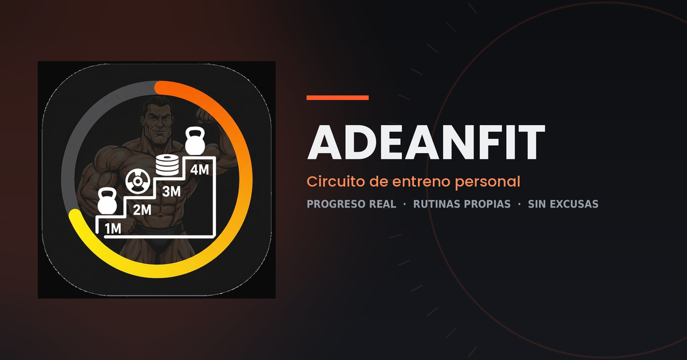

### 🔥 [**Probar la app en vivo →**](https://adeangomez.github.io/ADEANEASYFIT/)

---

## 💪 ¿Qué es Adeanfit?

**Adeanfit** es mi propia herramienta de entrenamiento: una app que diseñé y programé para llevar mi progreso en el gimnasio sin depender de hojas de Excel sueltas ni notas en el móvil que se pierden a la semana.

No es una app genérica descargada de una tienda de aplicaciones — es un sistema hecho a medida, pensado para gente que entrena en serio y quiere **datos reales de su evolución**, no solo apuntar números.

Si estás pensando en entrenar conmigo o quieres saber cómo trabajo el seguimiento de progreso, esta app es un buen ejemplo de mi forma de enfocar el entrenamiento: **estructura, disciplina y medición constante.**

---

## ✨ Qué hace

| | |
|---|---|
| 🏋️ **Circuito fijo de entreno** | Sigue tu rutina en el orden correcto, sesión a sesión — sin la tentación de saltarte el día que toca porque "hoy no me apetece". |
| 📊 **Progreso semanal y mensual, con gráficas** | Compara tu volumen y peso máximo periodo a periodo, y visualiza tu evolución completa en cada ejercicio con gráficas de línea. |
| 📋 **Rutinas 100% personalizables** | Crea tantas rutinas como quieras desde cero, o pídele a la IA que te diseñe una. |
| 🤖 **Análisis con IA** | Recibe una valoración honesta de tu progreso y recomendaciones concretas para mejorar. |
| 🗂️ **Historial completo** | Cada sesión queda registrada con desglose serie a serie, y puedes corregir errores sin liarla. |

---

## 📖 Tutorial — cómo usar la app

<b>Despliega aquí la guía completa (acceso, rutinas, progreso, historial y más)</b>

### 1. Acceso

Adeanfit funciona con **cuentas cerradas**: nadie se registra por su cuenta, solo el administrador crea usuarios. Una vez tengas usuario y contraseña, entras normal — el dispositivo recuerda tu sesión hasta que cierres sesión tú mismo. Puedes cambiar tu propia contraseña cuando quieras desde tu perfil (arriba a la derecha).

### 2. El circuito de entreno (pestaña "Entrenar")

La app te muestra siempre el día que toca de tu rutina activa, en orden fijo — no puedes elegir saltarte días. Para cada ejercicio, escribes kg y repeticiones de cada serie, y pulsas **"Guardar entrenamiento y pasar al siguiente día"**.

> Tras guardar, el botón queda bloqueado 5 segundos con cuenta atrás — es para evitar que se te cuelen dos días seguidos por pulsar dos veces sin querer.

### 3. Rutinas (pestaña "Rutinas")

- **Crear a mano**: nombre → días → ejercicios y series de cada día.
- **Generar con IA**: describe en una frase lo que quieres (p. ej. *"rutina de 4 días, prioridad piernas y espalda"*) y revisa la propuesta antes de guardarla.
- **Activar**: cambia qué rutina sigue el circuito (empieza desde el día 1 de esa rutina).
- **Eliminar**: no se puede borrar la rutina activa; el historial de sesiones ya guardadas nunca se pierde al borrar una rutina.

### 4. Progreso — el corazón del seguimiento

Por cada ejercicio con datos verás:
- **Comparativa semanal/mensual** de volumen y peso máximo, con flechas de mejora/empeoramiento.
- **Gráfica de evolución**: una línea con todo tu historial de peso máximo en ese ejercicio, verde si la tendencia es de subida, roja si es de bajada — de un vistazo ves picos, bajones y estancamientos. Hacen falta al menos 2 sesiones registradas del ejercicio.
- **Análisis con IA**: un botón que revisa todo tu historial real y te da una valoración + 3 recomendaciones concretas.

### 5. Historial (pestaña "Historial")

Cada sesión aparece con fecha exacta (DD-MM-AAAA), rutina y día. Tócala para desplegar el desglose serie a serie (kg × reps de cada una).

Cada sesión tiene un botón de eliminar. Si borras tu **sesión más reciente** de la rutina activa, el circuito **retrocede un día automáticamente** — pensado justo para corregir un guardado accidental sin liar el resto del historial.

### 6. Para el administrador

Desde `admin.html`, con tu clave de administrador:
- Crear usuarios nuevos (usuario + contraseña)
- **Suspender** una cuenta (le corta el acceso sin borrar sus datos) y **reactivarla** cuando quieras, o **eliminarla** del todo
- **Progreso de usuarios**: elige cualquier cuenta y consulta su historial completo y una gráfica de su evolución total, sin necesidad de que esa persona te enseñe su móvil

---

## 📸 Así se ve

*(Interfaz oscura, pensada para usarse en el gimnasio: contraste alto, botones grandes, cero distracciones.)*

---

## 🎯 Sobre mí

Entreno gimnasio, pádel y running de forma combinada, y creo mis propias herramientas cuando las que existen no encajan con lo que necesito. Esta app es una muestra de esa forma de trabajar: **medir todo, no dejar nada a la improvisación.**

Si buscas a alguien que se tome el entrenamiento  con ese nivel de rigor, hablemos.

### 📩 Contacto

**📧 [adeangomez873@gmail.com](mailto:adeangomez873@gmail.com)**  ·  **📸 [@adeangomez](https://instagram.com/adeangomez)**

---

Adeanfit © 2026 · Proyecto personal, construido desde cero.

